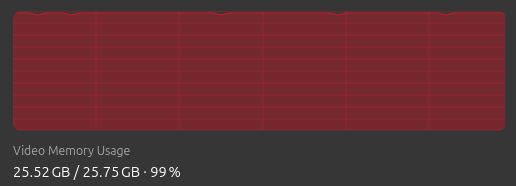
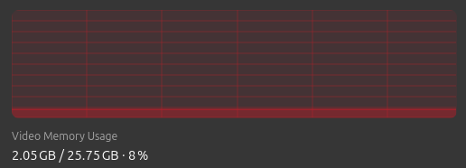

# Caching Memory Allocator

Julia uses Garbage-Collection (GC) for automatic memory management.
However, it does not know about other memory spaces,
therefore it sees no difference between 1 KiB GPU allocation and 1 GiB
and doesn't free it in time.

This leads to a situations where all of the GPU memory is used,
even though your algorithm only requires a fraction of it.

Current mechanism of dealing with OOM (Out-Of-Memory) errors during allocations
is to manually trigger GC and retry allocating again doing this in several rounds
each more aggressive than previous.

However, manually triggering GC is very expensive, since it requires scanning
all Julia objects, not just ROCArrays, so the actual memory freeing takes a
fraction of GC time:


On the image above, red region is a call to GC and green region is
where actual GPU memory is being freed.

---

To help with memory management, we can use caching memory allocator.
It is usefult in scenarios where we execute the same function multiple times
and have the same memory allocation pattern.
One such example is training DL models, where given the model and its parameters
we compute loss, gradients w.r.t. loss and perform in-place parameter update.
In this case, every iteration performs same operations and memory allocations
and with caching allocator we can efficiently re-use them without returning
the memory back to OS.

## Example

We have a for-loop, where each iteration requires 2 GiB of VRAM.
We create a caching allocator with the name `:loop` and pass a function to
execute.
First iteration will allocate, but subsequent won't.

```julia
using AMDGPU

function main()
    n = 1024^2 * 256
    for i in 1:1000
        AMDGPU.with_caching_allocator(:loop, n) do n
            sin.(AMDGPU.rand(Float32, n)) # 2 GiB allocation
            return
        end
    end
end
```

The reason for marking a region of code where to re-use the memory and
not extending it to the whole program instead, is because we cannot rely on GC
to tell us when the memory is no longer used (it is too slow for that),
so we create such region manually.

You can free all memory held by allocator, by invalidating it using its name
with [`AMDGPU.invalidate_caching_allocator!`](@ref).
Or if you want some region of code within [`AMDGPU.with_caching_allocator`](@ref)
to execute without relying on cache, use [`AMDGPU.with_no_caching`](@ref).

||Without Caching Allocator|With Caching Allocator|
|:---:|:---:|:---:|
|VRAM Usage|||
|Execution time (seconds)|`12.865149`|`0.020943`|

## API

```@docs
AMDGPU.with_caching_allocator
AMDGPU.with_no_caching
AMDGPU.invalidate_caching_allocator!
```
