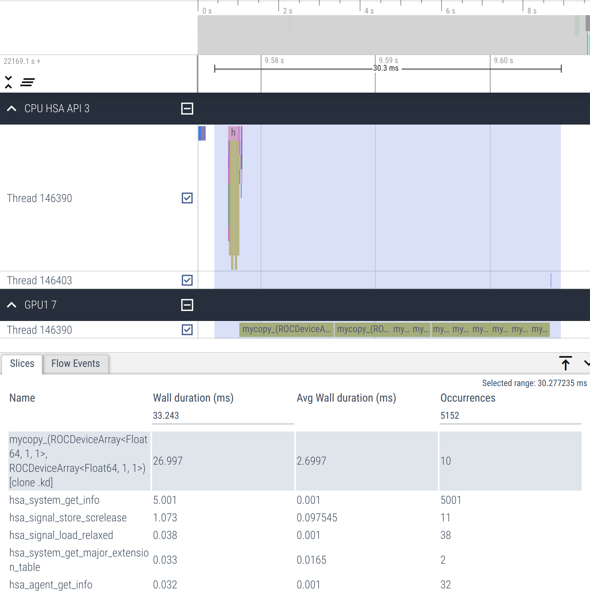

## rocprof

rocprof allows profiling both HSA & HIP API calls.

Let's profile simple copying kernel saved in `profile.jl` file:
```julia
using AMDGPU

function mycopy!(dst, src)
    i = workitemIdx().x + (workgroupIdx().x - 1) * workgroupDim().x
    if i ≤ length(dst)
        @inbounds dst[i] = src[i]
    end
    return
end

function main(N)
    src = ROCArray{Float64}(undef, N)
    dst = ROCArray{Float64}(undef, N)
    nthreads = 256
    nblocks = cld(N, nthreads)

    for i in 1:10
        @roc groupsize=nthreads gridsize=nblocks mycopy!(dst, src)
        AMDGPU.synchronize()
    end

    AMDGPU.unsafe_free!(dst)
    AMDGPU.unsafe_free!(src)
    AMDGPU.synchronize()
    return
end
main(2^24)
```

```bash
ENABLE_JITPROFILING=1 rocprof --hip-trace --hsa-trace julia ./profile.jl
```

This will produce `results.json` (amond other files) which can be visualized
using [Perfetto UI](https://ui.perfetto.dev/).

|Zoomed out|Zoomed in|
|:---:|:---:|
|||

Here we can clearly see that host synchronization after each kernel dispatch
causes poor device occupancy (empty spaces between kernel dispatches).

We can fix this by moving synchronization outside the loop so that it happens only once.

```julia
    ...
    for i in 1:10
        @roc groupsize=nthreads gridsize=nblocks mycopy!(dst, src)
    end
    AMDGPU.synchronize()
    ...
```

Running profiling again and visualizing results we now see that
kernel launches are adjacent to each other and that the average
wall duaration is lower.

|Zoomed out|Zoomed in|
|:---:|:---:|
|||
