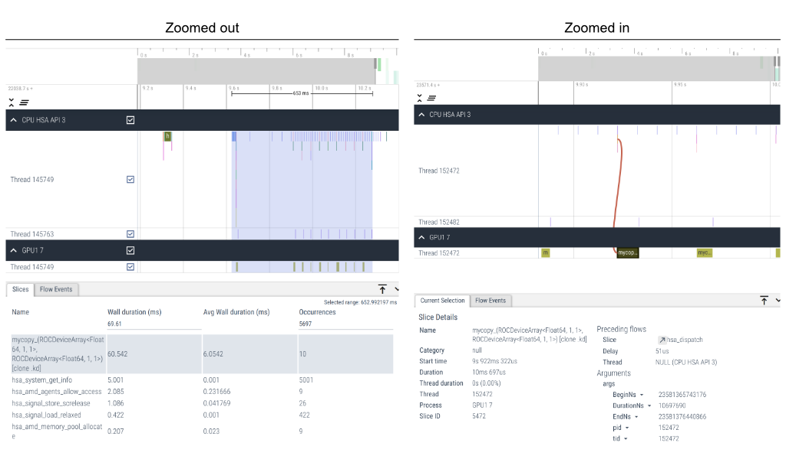
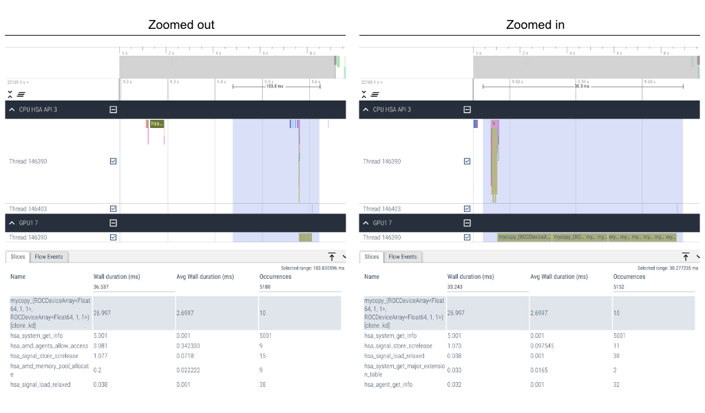

# Profiling

## rocprof

[rocprof](https://github.com/ROCm/rocm-systems/tree/develop/projects/rocprofiler)
allows profiling HSA & HIP API calls, kernel launches, and more...
Multiple major versions are available: `rocprof`, `rocprofv2` and `rocprofv3`.

Let's profile a simple copying kernel saved in a `profile.jl` file:
```julia
using AMDGPU

function mycopy!(dst, src)
    i = workitemIdx().x + (workgroupIdx().x - 1) * workgroupDim().x
    if i ≤ length(dst)
        @inbounds dst[i] = src[i]
    end
    return
end

function main(N)
    src = ROCArray{Float64}(undef, N)
    dst = ROCArray{Float64}(undef, N)
    groupsize = 256               # nthreads
    gridsize = cld(N, groupsize)  # nblocks

    for i in 1:10
        @roc groupsize=groupsize gridsize=gridsize mycopy!(dst, src)
        AMDGPU.synchronize()
    end

    AMDGPU.unsafe_free!(dst)
    AMDGPU.unsafe_free!(src)
    AMDGPU.synchronize()
    return
end
main(2^24)
```

### Profiling problematic code

As mentioned above, there are different `rocprof` versions and see which one works the best.
On older ROCm versions, the newer `rocprofv2` and `rocprofv3` may not work so well.

!!! note
    While AMDGPU.jl uses the HIP API, only `--hsa-trace` seems to capture CPU API calls,
    of the lower-level HSA API, while `--hip-trace` has no effect.

    This applies to ROCm 6.2.4 at least, and was tested on AMDGPU 2.1.3.
    If with other versions HIP API calls can be captured then please amend this documentation.

#### rocprof
```bash
rocprof --hsa-trace --roctx-trace julia ./profile.jl
```

This enables HSA and ROC-TX (see below) tracing.
Memory copies and kernel launches are reported as well.

This will produce an `output.json` file which can be visualized
using [Perfetto UI](https://ui.perfetto.dev/).

#### rocprofv2
```bash
rocprofv2 --plugin perfetto --hsa-trace --roctx-trace --kernel-trace -o prof julia ./profile.jl
```

In principle this should enable various types of tracing,
but note that on ROCm 6.2.4 only kernel launches seem to be reported.

This will produce a `prof_output.pftrace` file which can be visualized
using [Perfetto UI](https://ui.perfetto.dev/).

#### rocprofv3
```bash
rocprofv3 --output-format pftrace --hsa-trace --marker-trace --kernel-trace --memory-copy-trace  -- julia ./profile.jl
```

This will produce a number of `prof_output.pftrace` files which can be visualized
using [Perfetto UI](https://ui.perfetto.dev/).

`rocprofv3` is now recommended by ADM, however on ROCm 6.2.4 nothing seems to be reported.

#### Visualization of the results
Here is an example of visualizing the `profile.jl` script above in Perfetto.
Use `W`/`S` to zoom in/out and `A`/`D` to move left/right in the timeline.



Here we can clearly see that host synchronization after each kernel dispatch
causes poor device occupancy (empty spaces between kernel dispatches).

### Profiling fixed code

We can fix this by moving synchronization outside the loop so that it happens only once.

```julia
    ...
    for i in 1:10
        @roc groupsize=groupsize gridsize=gridsize mycopy!(dst, src)
    end
    AMDGPU.synchronize()
    ...
```

Running profiling again and visualizing results we now see that
kernel launches are adjacent to each other and that the average
wall duration is lower.



### Marking regions
When launching lots of kernels, it can be difficult to understand
the trace in terms of high-level program behavior.
In that case, the ROC-TX API can be used to mark regions that will be visible in the traces.

Here is an example of calling the API directly:
```julia
function rangePush(message)
    @ccall "libroctx64".roctxRangePushA(message::Ptr{Cchar})::Cint
end

function rangePop()
    @ccall "libroctx64".roctxRangePop()::Cint
end

rangePush("Section name")
# Launch some kernels, call some functions, etc...
rangePop()
```

While [ROCTX.jl](https://github.com/JuliaGPU/ROCTX.jl) aims to offer a Julia wrapper around it,
it does not seem to be working yet. PRs welcome!
(Note: the `ccall`s above do _not_ require ROCTX.jl to be loaded!)

## Debugging

Use `HIP_LAUNCH_BLOCKING=1` to synchronize immediately after launching GPU kernels.
This will allow to pinpoint exact kernel that caused the exception.
