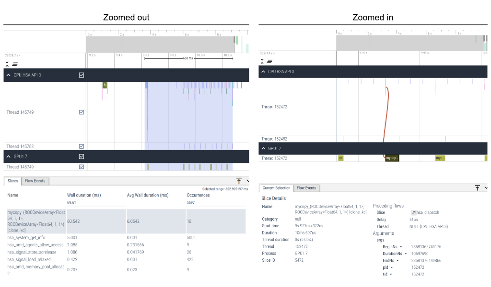
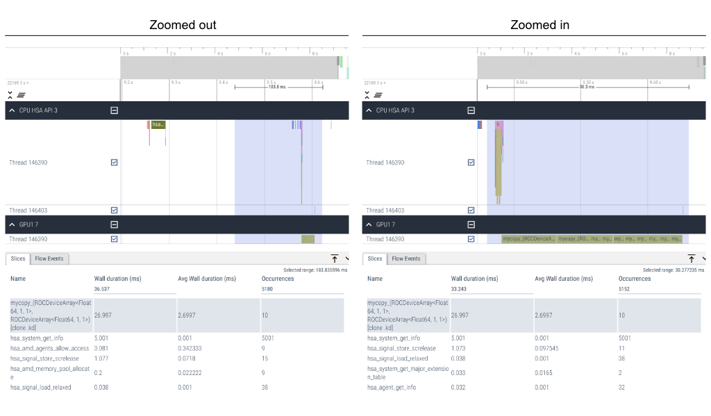

# Profiling

## rocprof

[rocprofv3](https://rocm.docs.amd.com/projects/rocprofiler-sdk/en/latest/how-to/using-rocprofv3.html)
allows profiling both HSA & HIP API calls.

Let's profile simple copying kernel saved in `profile.jl` file:
```julia
using AMDGPU

function mycopy!(dst, src)
    i = workitemIdx().x + (workgroupIdx().x - 1) * workgroupDim().x
    if i ≤ length(dst)
        @inbounds dst[i] = src[i]
    end
    return
end

function main(N)
    src = ROCArray{Float64}(undef, N)
    dst = ROCArray{Float64}(undef, N)
    groupsize = 256               # nthreads
    gridsize = cld(N, groupsize)  # nblocks

    for i in 1:10
        @roc groupsize=groupsize gridsize=gridsize mycopy!(dst, src)
        AMDGPU.synchronize()
    end

    AMDGPU.unsafe_free!(dst)
    AMDGPU.unsafe_free!(src)
    AMDGPU.synchronize()
    return
end
main(2^24)
```

### Profiling problematic code

```bash
ENABLE_JITPROFILING=1 rocprofv3 --output-directory ./profiling --output-format pftrace --hip-trace --hsa-trace --kernel-trace -- julia ./profile.jl
```

This will produce `.pftrace` file which can be visualized using [Perfetto UI](https://ui.perfetto.dev/).



Here we can clearly see that host synchronization after each kernel dispatch
causes poor device occupancy (empty spaces between kernel dispatches).

### Profiling fixed code

We can fix this by moving synchronization outside the loop so that it happens only once.

```julia
    ...
    for i in 1:10
        @roc groupsize=groupsize gridsize=gridsize mycopy!(dst, src)
    end
    AMDGPU.synchronize()
    ...
```

Running profiling again and visualizing results we now see that
kernel launches are adjacent to each other and that the average
wall duration is lower.



## Debugging

Use `HIP_LAUNCH_BLOCKING=1` to synchronize immediately after launching GPU kernels.
This will allow to pinpoint exact kernel that caused the exception.
